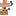
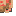
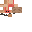

Ornithe Art
===========
These are the attributions for images that are used throughout as various pieces of art for The Ornithe Project and any Ornithe-related things.

Model Textures
--------------

"[house_finch_noisy_texture](house_finch_noisy_texture.png)" by [Skye](https://github.com/FubyCutie) is licensed under [CC BY-SA 4.0](LICENSE)

***

"[sarah_house_finch_noisy](sarah_house_finch_noisy.png)" by [Skye](https://github.com/FubyCutie) is licensed under [CC BY-SA 4.0](LICENSE)

***

"[wider_house_finch_noise_palette](wider_house_finch_noise_palette.png)" by [Skye](https://github.com/FubyCutie) is licensed under [CC BY-SA 4.0](LICENSE)