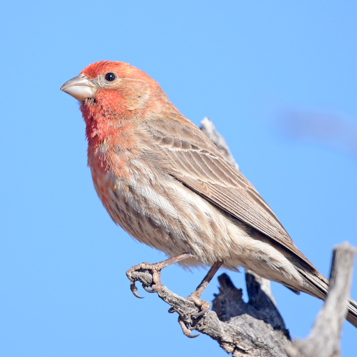

Ornithe Logo
============
These are the attributions for the images that are used throughout as the logo for The Ornithe Project and any Ornithe-related things.

Images
------

"[House Finch, southeastern Arizona 06](https://commons.wikimedia.org/wiki/File:House_Finch,_southeastern_Arizona_06.jpg)" by [Vickie J Anderson](https://commons.wikimedia.org/wiki/User:VJAnderson) is licensed under [CC BY-SA 4.0](LICENSE)

***

"[House Finch, southeastern Arizona 06](https://commons.wikimedia.org/wiki/File:House_Finch,_southeastern_Arizona_06.jpg)" by [Vickie J Anderson](https://commons.wikimedia.org/wiki/User:VJAnderson), used under [CC BY-SA 4.0](LICENSE) / Cropped from original

***

"[House Finch, southeastern Arizona 06](https://commons.wikimedia.org/wiki/File:House_Finch,_southeastern_Arizona_06.jpg)" by [Vickie J Anderson](https://commons.wikimedia.org/wiki/User:VJAnderson), used under [CC BY-SA 4.0](LICENSE) / Cropped and downscaled from original

***

This work, "[Rainborb](Rainborb.jpg)" is adapted from "[House Finch, southeastern Arizona 06](https://commons.wikimedia.org/wiki/File:House_Finch,_southeastern_Arizona_06.jpg)" by [Vickie J Anderson](https://commons.wikimedia.org/wiki/User:VJAnderson), used under [CC BY-SA 4.0](LICENSE). "Rainborb" is licensed under [CC BY-SA 4.0](LICENSE) by [KayleighWasTaken](https://github.com/KayleighWasTaken)

***

"[Rainborb](Rainborb.png)" by [KayleighWasTaken](https://github.com/KayleighWasTaken), used under [CC BY-SA 4.0](LICENSE) / Cropped from original

***

This work, "[PrideBurdDeluxe](PrideBurdDeluxe.png)" is adapted from "[Rainborb](Rainborb.jpg)" by [KayleighWasTaken](https://github.com/KayleighWasTaken), used under [CC BY-SA 4.0](LICENSE). "PrideBurdDeluxe" is licensed under [CC BY-SA 4.0](LICENSE) by [Phantazap](https://github.com/Phantazap)

Unused
------

This work, "[Rainbirb](Rainbirb.jpg)" is adapted from "[House Finch, southeastern Arizona 06](https://commons.wikimedia.org/wiki/File:House_Finch,_southeastern_Arizona_06.jpg)" by [Vickie J Anderson](https://commons.wikimedia.org/wiki/User:VJAnderson), used under [CC BY-SA 4.0](LICENSE). "Rainbirb" is licensed under [CC BY-SA 4.0](LICENSE) by [KayleighWasTaken](https://github.com/KayleighWasTaken)
